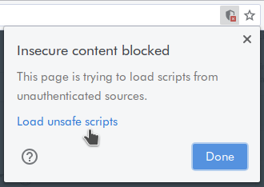

# Setting up Your LMS Development Environment

First you'll need to install:

* [Git](https://git-scm.com/).
  On Ubuntu: `sudo apt install git`, on macOS: `brew install git`.
* [pyenv](https://github.com/pyenv/pyenv).
  See [pyenv's README](https://github.com/pyenv/pyenv#readme) for install instructions.
  First you need to [install the Python build dependencies](https://github.com/pyenv/pyenv/wiki#suggested-build-environment)
  then on macOS use the **Homebrew** installation method,
  on Ubuntu use the **Basic GitHub Checkout** method.
  You _don't_ need to set up pyenv's shell integration ("shims"), you can
  [use pyenv without shims](https://github.com/pyenv/pyenv#using-pyenv-without-shims).
* [GNU Make](https://www.gnu.org/software/make/).
  This is probably already installed or will have been installed while installing pyenv, run `make --version` to check.
* [Docker](https://docs.docker.com/install/).
  Follow the [instructions on the Docker website](https://docs.docker.com/install/)
  to install it.  
  You **don't** need to install Docker Compose, the development environment
  will install it automatically for you in tox.  
  You **do** need to set up the `docker` command to work without `sudo`,
  on Linux this means following Docker's [Post-installation steps for Linux](https://docs.docker.com/engine/install/linux-postinstall/).
* [Node](https://nodejs.org/) and npm.
  On Ubuntu: `sudo snap install --classic node`.
  On macOS: `brew install node`.
* [Yarn](https://yarnpkg.com/): `sudo npm install -g yarn`.
* `pg_config`. On Ubuntu: `sudo apt install libpq-dev`. On macOS: `brew install postgresql`.

* The LMS app integrates h, the Hypothesis client and Via, so you will need to
  set up development environments for each of those before you can develop the
  LMS app:

  * https://h.readthedocs.io/en/latest/developing/install/
  * https://h.readthedocs.io/projects/client/en/latest/developers/developing/
  * https://github.com/hypothesis/via

Then to set up your development environment:

```terminal
git clone https://github.com/hypothesis/lms.git
cd lms
make services
make devdata
make help
```

Bypassing the browser's "unsafe scripts" (mixed content) blocking
-----------------------------------------------------------------

If you use our hosted Canvas instance at <https://hypothesis.instructure.com/>
to test your local dev instance of the app you'll get "unsafe scripts" or "mixed content"
warnings from your browser. This is because hypothesis.instructure.com uses https but your
local dev app, which is running in an iframe in hypothesis.instructure.com, only uses http.

You'll see a blank iframe in Canvas where the app should be, along with a warning about
"trying to launch insecure content" like this:


If you open the browser's developer console you should see an error message like:

    Mixed Content: The page at 'https://hypothesis.instructure.com/...' was loaded over HTTPS,
    but requested an insecure form action 'http://localhost:8001/...'. This request has been
    blocked; the content must be served over HTTPS.

Fortunately you can easily bypass this mixed content blocking by your browser.
You should also see an "Insecure content blocked" icon in the top right of the location bar:



Click on the <samp>Load unsafe scripts</samp> link and the app should load successfully.

Overview and code design
------------------------

There are three presentations for developers that describe what the Hypothesis LMS app is and how it works. The **speaker notes** in these presentations also contain additional notes and links:

1. [LMS App Demo & Architecture](https://docs.google.com/presentation/d/1eRMjS5B8Yja6Aupp8oKi-UztIJ9_8KRViSc6OMDLfMY/)
2. [LMS App Code Design Patterns](https://docs.google.com/presentation/d/1AWcDoHaV9aAvInefR54SJepZiNM08Zou9jxNssccw3c/)
3. [Speed Grader Workshop](https://docs.google.com/presentation/d/1TJF9SXRMbtHCPnkD9sy-TXe_u55--zYt6veVW0M6leA/) (about the design of the first version of our Canvas Speed Grader support)

Changing the Project's Python Dependencies
------------------------------------------

### To Add a New Dependency

Add the dependency to the appropriate [`requirements/*.in`](requirements/)
file(s) and then run:

```terminal
make requirements
```

### To Remove a Dependency

Remove the dependency from the appropriate [`requirements/*.in`](requirements)
file(s) and then run:

```terminal
make requirements
```

### To Upgrade or Downgrade a Dependency

We rely on [Dependabot](https://github.com/dependabot) to keep all our
dependencies up to date by sending automated pull requests to all our repos.
But if you need to upgrade or downgrade a dependency manually you can do that
locally.

To upgrade a package to the latest version in all `requirements/*.txt` files:

```terminal
make requirements --always-make args='--upgrade-package <FOO>'
```

To upgrade or downgrade a package to a specific version:

```terminal
make requirements --always-make args='--upgrade-package <FOO>==<X.Y.Z>'
```

To upgrade **all** dependencies to their latest versions:

```terminal
make requirements --always-make args=--upgrade
```
