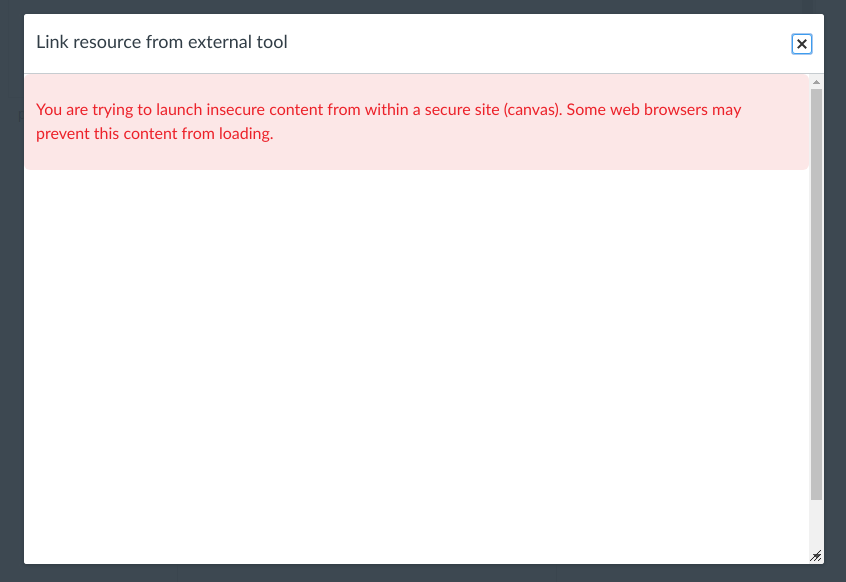
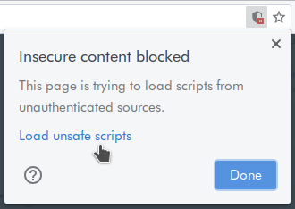

<a href="https://github.com/hypothesis/lms/actions/workflows/ci.yml?query=branch%3Amain"></a>
<a></a>
<a href="https://github.com/hypothesis/lms/blob/main/LICENSE"></a>
<a href="https://github.com/hypothesis/cookiecutters/tree/main/pyramid-app"></a>
<a href="https://black.readthedocs.io/en/stable/"></a>

# LMS

An app for integrating Hypothesis with Learning Management Systems (LMS's).

See also:

* [Configuration](docs/configuration.md) - Details of environment variables and setup
* [Setting up a region](docs/setting-up-a-region.md) - How to setup a new geographic region

## Setting up Your LMS Development Environment

First you'll need to install:

* [Git](https://git-scm.com/).
  On Ubuntu: `sudo apt install git`, on macOS: `brew install git`.
* [GNU Make](https://www.gnu.org/software/make/).
  This is probably already installed, run `make --version` to check.
* [pyenv](https://github.com/pyenv/pyenv).
  Follow the instructions in pyenv's README to install it.
  The **Homebrew** method works best on macOS.
  The **Basic GitHub Checkout** method works best on Ubuntu.
  You _don't_ need to set up pyenv's shell integration ("shims"), you can
  [use pyenv without shims](https://github.com/pyenv/pyenv#using-pyenv-without-shims).
* [Docker Desktop](https://www.docker.com/products/docker-desktop/).
  On Ubuntu follow [Install on Ubuntu](https://docs.docker.com/desktop/install/ubuntu/).
  On macOS follow [Install on Mac](https://docs.docker.com/desktop/install/mac-install/).
* [Node](https://nodejs.org/) and npm.
  On Ubuntu: `sudo snap install --classic node`.
  On macOS: `brew install node`.
* [Yarn](https://yarnpkg.com/): `sudo npm install -g yarn`.

Then to set up your development environment:

```terminal
git clone https://github.com/hypothesis/lms.git
cd lms
make services
make devdata
make help
```

To run LMS locally run `make dev` and visit http://localhost:8001.

## Changing the Project's Python Version

To change what version of Python the project uses:

1. Change the Python version in the
   [cookiecutter.json](.cookiecutter/cookiecutter.json) file. For example:

   ```json
   "python_version": "3.10.4",
   ```

2. Re-run the cookiecutter template:

   ```terminal
   make template
   ```

3. Re-compile the `requirements/*.txt` files.
   This is necessary because the same `requirements/*.in` file can compile to
   different `requirements/*.txt` files in different versions of Python:

   ```terminal
   make requirements
   ```

4. Commit everything to git and send a pull request

## Changing the Project's Python Dependencies

### To Add a New Dependency

Add the package to the appropriate [`requirements/*.in`](requirements/)
file(s) and then run:

```terminal
make requirements
```

### To Remove a Dependency

Remove the package from the appropriate [`requirements/*.in`](requirements)
file(s) and then run:

```terminal
make requirements
```

### To Upgrade or Downgrade a Dependency

We rely on [Dependabot](https://github.com/dependabot) to keep all our
dependencies up to date by sending automated pull requests to all our repos.
But if you need to upgrade or downgrade a package manually you can do that
locally.

To upgrade a package to the latest version in all `requirements/*.txt` files:

```terminal
make requirements --always-make args='--upgrade-package <FOO>'
```

To upgrade or downgrade a package to a specific version:

```terminal
make requirements --always-make args='--upgrade-package <FOO>==<X.Y.Z>'
```

To upgrade **all** packages to their latest versions:

```terminal
make requirements --always-make args=--upgrade
```

### Using self signed certificates with HTTPS

By default `make dev` runs the web application on two ports: 8001 for HTTP and 48001 for HTTPS with a self-signed certificate.

Using HTTPS is required in most LMS's for LTI 1.3 and for example in D2L it's required for any usage of their API in all LTI versions.

To use HTTPS you'll need to instruct your browser to trust the self-signed certificate.

In Chrome you can do do this with the following flag:


<chrome://flags/#allow-insecure-localhost>


### Bypassing the browser's "unsafe scripts" (mixed content) blocking

If you use our hosted Canvas instance at <https://hypothesis.instructure.com/>
to test your local dev instance of the app you'll get "unsafe scripts" or "mixed content"
warnings from your browser. This is because hypothesis.instructure.com uses https but your
local dev app, which is running in an iframe in hypothesis.instructure.com, only uses http.

You'll see a blank iframe in Canvas where the app should be, along with a warning about
"trying to launch insecure content" like this:



If you open the browser's developer console you should see an error message like:

    Mixed Content: The page at 'https://hypothesis.instructure.com/...' was loaded over HTTPS,
    but requested an insecure form action 'http://localhost:8001/...'. This request has been
    blocked; the content must be served over HTTPS.

Fortunately you can easily bypass this mixed content blocking by your browser.
You should also see an "Insecure content blocked" icon in the top right of the location bar:



Click on the <samp>Load unsafe scripts</samp> link and the app should load successfully.

## Overview and code design

There are three presentations for developers that describe what the Hypothesis LMS app is and how it works. The **speaker notes** in these presentations also contain additional notes and links:

1. [LMS App Demo & Architecture](https://docs.google.com/presentation/d/1eRMjS5B8Yja6Aupp8oKi-UztIJ9_8KRViSc6OMDLfMY/)
2. [LMS App Code Design Patterns](https://docs.google.com/presentation/d/1AWcDoHaV9aAvInefR54SJepZiNM08Zou9jxNssccw3c/)
3. [Speed Grader Workshop](https://docs.google.com/presentation/d/1TJF9SXRMbtHCPnkD9sy-TXe_u55--zYt6veVW0M6leA/) (about the design of the first version of our Canvas Speed Grader support)
